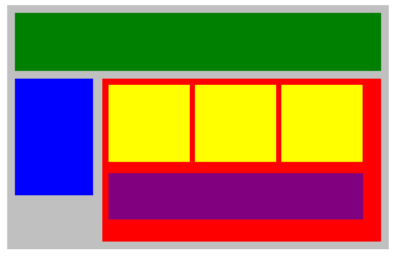
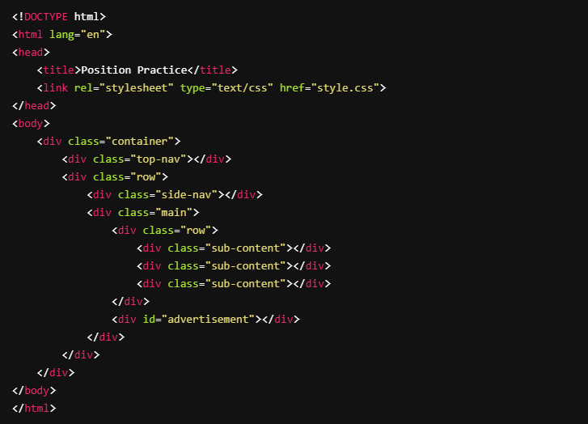
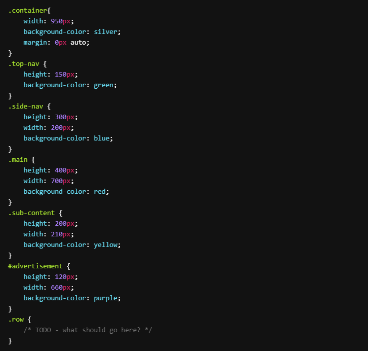
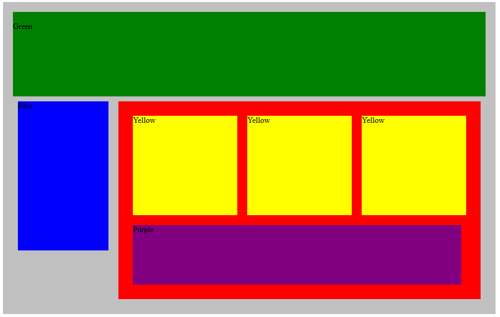

# Flex our Blocks

Try to duplicate the image below by adjusting the CSS code provided. Use `margin` and `padding` to adjust the spaces between divisions and use `display: flex;` to be able to put each block in its proper place.

Here's our HTML code:

And our starting CSS:

- [x] Recreate the image above using flex properties

Here is how mine turned out.

